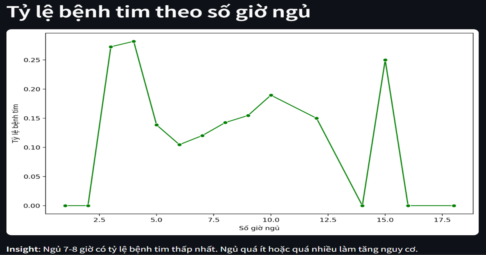
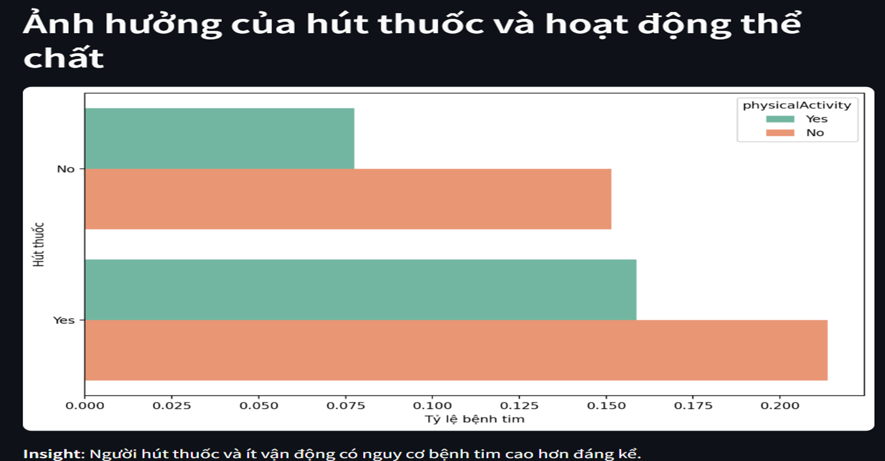

# Phân tích Dữ liệu Nhịp tim với MongoDB và Streamlit

---

## Tên Đề tài
- **Phân tích Dữ liệu Nhịp tim với MongoDB và Streamlit**

## Thành viên Nhóm
- Phạm Thị Phượng - 2221050063
- Vũ Ngọc Ánh - 2251050002
- Quách Thị Diệu Linh - 2221050232

## Giới thiệu Đề tài
Đây là một ứng dụng được xây dựng bằng Python, sử dụng Streamlit để tạo giao diện, MongoDB để lưu trữ dữ liệu, và các thư viện như Pandas, Matplotlib, Seaborn để xử lý và trực quan hóa dữ liệu. Mục tiêu của chúng tôi là phân tích mối quan hệ giữa các yếu tố như tuổi, giấc ngủ, và lối sống với bệnh tim, cung cấp các biểu đồ trực quan và thông tin hữu ích cho người dùng, đặc biệt là trong lĩnh vực y tế.

---

## Mô tả Tập Dữ liệu
- **Nguồn dữ liệu**: Sử dụng file `heart_2020_cleaned.csv`, một tập dữ liệu công khai (có thể từ CDC hoặc nguồn tương tự) đã được làm sạch.
- **Quy mô**: Lấy 1500 bản ghi đầu tiên để thử nghiệm.
- **Cấu trúc**:
  - Bao gồm thông tin như `AgeCategory` (nhóm tuổi), `Sex` (giới tính), `Race` (chủng tộc), `HeartDisease` (bệnh tim), `BMI` (chỉ số khối cơ thể), `SleepTime` (giấc ngủ), `PhysicalActivity` (hoạt động thể chất), `GenHealth` (sức khỏe tổng quát), `Smoking` (hút thuốc), `AlcoholDrinking` (uống rượu), `PhysicalHealth` (sức khỏe thể chất), và `MentalHealth` (sức khỏe tinh thần).
- **Lưu trữ**: Dữ liệu được tổ chức thành 3 collection trong MongoDB:
  - `patients`: Thông tin cơ bản (tuổi, giới tính, chủng tộc).
  - `health_indicators`: Chỉ số sức khỏe.
  - `lifestyle`: Thói quen sống.
- **Đặc điểm**: Dữ liệu mẫu, không chứa thông tin cá nhân thật, liên kết qua `patient_id` duy nhất.

---

## Các Bước Thực hiện (Chi tiết, Dễ Hiểu)

### 1. Chuẩn bị Môi trường
- **Cài Python**: Đảm bảo Python (3.7 trở lên) đã được cài đặt.
- **Cài Thư viện**: Mở terminal, chạy lệnh:
  ```bash
  pip install streamlit pandas matplotlib seaborn pymongo

- **Cài MongoDB**: Tải và chạy MongoDB cục bộ (localhost:27017) từ mongodb.com.

### 2. Khởi tạo và lưu dữ liệu
- **Kết nối MongoDB**: Dùng `MongoClient('mongodb://localhost:27017/')` để tạo database `heart_disease_db`.
- **Xóa Dữ liệu Cũ**: `db.patients.drop(), db.health_indicators.drop(), db.lifestyle.drop()` xóa collection cũ.
- **Đọc và Lưu Dữ liệu**:
    + `pd.read_csv('heart_2020_cleaned.csv').head(1500)` đọc 1500 dòng.
    + Dùng vòng lặp for với `uuid.uuid4()` để tạo patient_id, sau đó chèn dữ liệu vào 3 collection (patients, health_indicators, lifestyle).
- **Kết quả**: In ra Đã nhập 1000 bản ghi vào mỗi collection!.

### 3. Tạo Index
Dùng `create_index()` để tạo index cho `patient_id` và `HeartDisease` nhằm tăng tốc độ truy vấn:
- `db.patients.create_index([("patient_id", 1)])`
- `db.health_indicators.create_index([("patient_id", 1), ("HeartDisease", 1)])`
- `db.lifestyle.create_index([("patient_id", 1)])`


### 4. Các lệnh CRUD
- Create - Read - Update - Delete

### 5. Các tính năng phân tích - Phân tích dữ liệu với Aggregation:
#### `run_age_heart_disease()`: Tính tỷ lệ bệnh tim theo nhóm tuổi, vẽ biểu đồ cột.
**Ví dụ**: Giả sử chúng ta có dữ liệu mẫu nhỏ trong MongoDB với 5 bệnh nhân:
- Collection `patients`

| patient_id               | AgeCategory | Sex    | Race  |
|--------------------------|-------------|--------|-------|
| 123e4567-e89b-12d3      | 65-69       | Male   | White |
| 123e4567-e89b-12d4      | 65-69       | Female | White |
| 123e4567-e89b-12d5      | 25-29       | Male   | Black |
| 123e4567-e89b-12d6      | 25-29       | Female | Asian |
| 123e4567-e89b-12d7      | 18-24       | Male   | Other |

- Collection `health_indicators`.

| patient_id               | HeartDisease | BMI  | SleepTime | PhysicalActivity | GenHealth  |
|--------------------------|--------------|------|-----------|------------------|------------|
| 123e4567-e89b-12d3      | Yes          | 27.5 | 6         | Yes              | Good       |
| 123e4567-e89b-12d4      | No           | 25.0 | 7         | No               | Fair       |
| 123e4567-e89b-12d5      | No           | 23.0 | 8         | Yes              | Very good  |
| 123e4567-e89b-12d6      | No           | 22.5 | 6         | Yes              | Good       |
| 123e4567-e89b-12d7      | No           | 24.0 | 7         | No               | Fair       |

**Quy trình Phân tích với Aggregation**

- Bước 1: `$lookup`: Kết nối dữ liệu từ `health_indicators` vào `patients` dựa trên `patient_id`.
    + Tạo mảng `health` trong mỗi bản ghi của `patients`, chứa thông tin sức khỏe từ `health_indicators`.
    + Kết quả: Mỗi bản ghi `patients` có thêm trường `health`, ví dụ:
  ```json
  {
    "patient_id": "123e4567-e89b-12d3",
    "AgeCategory": "65-69",
    "health": [{ "HeartDisease": "Yes", "BMI": 27.5, ... }]
  }

- Bước 2: `$unwind`: Tách mảng health thành các bản ghi riêng lẻ.
    + Kết quả:
   ```json
  {
    "patient_id": "123e4567-e89b-12d3",
    "AgeCategory": "65-69",
    "health.HeartDisease": "Yes"
  }

- Bước 3: `$group`: Nhóm dữ liệu theo `AgeCategory`, tính tổng số người (total) và số người mắc bệnh tim (heartDiseaseCount).
    + `total`: Đếm số bản ghi trong mỗi nhóm bằng `$sum: 1`.
    + `heartDiseaseCount`: Dùng `$cond` để kiểm tra `health.HeartDisease == "Yes"`, nếu đúng thì cộng 1, ngược lại là 0.
    + Kết quả: 
        + `65-69`: `total = 2`, `heartDiseaseCount = 1` (chỉ bệnh nhân 123e4567-e89b-12d3 bị bệnh).
        + `25-29`: `total = 2`, `heartDiseaseCount = 0` (không ai bị bệnh).
        + `18-24`: `total = 1`, `heartDiseaseCount = 0`.

- Bước 4: `$project`: Tạo lại cấu trúc dữ liệu, tính tỷ lệ, và loại bỏ trường không cần thiết.
    + Cách tính:
        + `heartDiseaseRatio = heartDiseaseCount / total`.
        + Đổi `_id` thành `ageCategory`, giữ `total`, bỏ `_id`.
    + Kết quả:
        +  `65-69`: `ageCategory: "65-69", heartDiseaseRatio: 1/2 = 0.5, total: 2`.
        + `25-29`: `ageCategory: "25-29", heartDiseaseRatio: 0/2 = 0.0, total: 2`.
        + `18-24`: `ageCategory: "18-24", heartDiseaseRatio: 0/1 = 0.0, total: 1`.

- Bước 5: `$sort`: Sắp xếp theo ageCategory tăng dần.

#### `run_sleep_heart_disease()`: Tính tỷ lệ theo số giờ ngủ, vẽ biểu đồ đường.
#### `run_lifestyle_impact()`: Tính ảnh hưởng của hút thuốc và hoạt động thể chất, vẽ biểu đồ cột.


## Kết quả phân tích
### 1. Tỷ lệ bệnh tim theo nhóm tuổi

- Biểu đồ cột cho thấy nhóm tuổi 65+ có tỷ lệ bệnh tim cao nhất (khoảng 0.3-0.4), trong khi nhóm 18-24 thấp nhất (dưới 0.1).

### 2. Tỷ lệ bệnh tim theo số giờ ngủ

- Biểu đồ đường đạt đáy ở 7-8 giờ ngủ (tỷ lệ ~0.1), tăng ở dưới 6 giờ hoặc trên 9 giờ (~0.2-0.3).   

### 3. Ảnh hưởng của hút thuốc và hoạt động thể chất

- Biểu đồ cột cho thấy nhóm "Yes-Smoking" và "No-PhysicalActivity" có tỷ lệ cao nhất (~0.35), trong khi "No-Smoking" và "Yes-PhysicalActivity" thấp nhất (~0.1).


## Bảng phân công công việc

| STT | Họ tên              | MSSV       | Công việc phân công                       | Mô tả chi tiết công việc                  |
|-----|---------------------|------------|------------------------------------------|-------------------------------------------|
| 1   | Phạm Thị Phượng    | 2221050063 | - Thực hiện việc phân tích dữ liệu<br>- Tạo CRUD, giao diện Streamlit<br>- Tạo nội dung aggregation | - Viết code kết nối MongoDB, đọc csv, tạo collection từ dữ liệu<br>- Thực hiện CRUD<br>- Cài đặt hàm aggregation<br>- Tạo nội dung slide báo cáo |
| 2   | Vũ Ngọc Anh         | 2251050002 | - Phân tích dữ liệu với phương pháp Matplotlib<br>- Kiểm tra và sửa lỗi giao diện<br>- Viết Readme bản cáo | - Viết biểu đồ trực kê qua aggregation<br>- Đảm bảo giao diện Streamlit hiển thị đúng<br>- Viết file README |
| 3   | Quách Thị Diệu Linh | 2221050232 | - Xây dựng bảng dữ liệu với index cho MongoDB<br>- Kiểm thử | - Xây dựng bảng dữ liệu với index<br>- Kiểm thử |
